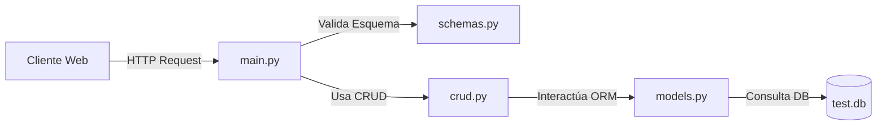

# Módulo 3: Fundamentos de Programación en Python

Este módulo introduce a los estudiantes en el desarrollo Backend con **Python**, abarcando desde la instalación y configuración del entorno, pasando por la lógica y sintaxis base de la programación estructurada, hasta el manejo de microframeworks modernos de desarrollo web y API REST.

---

## 📌 Temario y Contenido Clave

### 1. Configuración del Entorno y Frameworks Web (Sesiones 1 - 2)
Introducción y comparativa práctica de la arquitectura de diversos microframeworks web en Python:
- **Frameworks Tradicionales**: Ejemplos sencillos con **Bottle**, **CherryPy**, **Flask** y **Pyramid**.
- **FastAPI Moderno**: Desarrollo de APIs asíncronas de alto rendimiento con validación automática por **Pydantic** y conexión ORM por **SQLAlchemy** (base de datos `test.db`).

### 2. Estructura y Sintaxis Básica de Python (Sesiones 3 - 4)
- **Bloques e Identación**: Python utiliza la identación (espacios/tabuladores) obligatoriamente para delimitar bloques de código.
- **Tipos de Datos Primitivos**:
  - `int`, `float` (Numéricos).
  - `str` (Cadenas de texto).
  - `bool` (Valores booleanos: `True` o `False`).
- **Variables y Scope**: Declaración dinámica de variables y ámbito de las mismas (Locales vs. Globales).

### 3. Colecciones y Estructuras de Datos (Sesiones 4 y 8)
Python ofrece colecciones nativas versátiles para agrupar datos:
- **Listas (`list`)**: Mutables, ordenadas. Ejemplo: `[1, 2, 3]`. Métodos: `append()`, `pop()`, `insert()`, `remove()`.
- **Tuplas (`tuple`)**: Inmutables, ordenadas. Ejemplo: `(1, 2, 3)`.
- **Diccionarios (`dict`)**: Colecciones de pares Clave-Valor. Ejemplo: `{"nombre": "Aldo", "rol": "Admin"}`.
- **Conjuntos (`set`)**: Mutables, no ordenados, sin elementos duplicados. Ejemplo: `{1, 2, 3}`. Permite operaciones de conjuntos como unión, intersección y diferencia.

### 4. Estructuras de Control y Ciclos (Sesiones 5 - 7)
- **Condicionales**: Bloques `if`, `elif` y `else` con operadores lógicos (`and`, `or`, `not`) y de comparación (`==`, `!=`, `<`, `>`).
- **Bucle `for`**: Recorrido ordenado sobre colecciones u objetos de tipo `range`.
- **Bucle `while`**: Ejecución condicional reiterada.
- **Control de Ciclos**:
  - `break`: Termina inmediatamente el bucle.
  - `continue`: Omite el resto del bloque de código actual e inicia la siguiente iteración.

### 5. Definición y Uso de Funciones (Sesión 9)
Modularización del código para evitar duplicaciones:
- Declaración con la palabra clave `def`.
- **Parámetros y Retorno**: Envío de valores y uso del keyword `return`.
- **Valores por defecto**: Parámetros con valores predeterminados (ej. `def saludo(nombre="Usuario"):`).
- **Paso de Estructuras**: Envío de listas o diccionarios completos como argumentos para procesar datos complejos.

---

## 💻 Ejemplo Práctico: Estructura de una API básica en FastAPI

El bootcamp introduce la construcción estructurada de APIs en la carpeta `M3/4-Sesion2/fastapi`. A continuación se esquematiza el flujo de datos:

### Componentes Clave:
1. **`database.py`**: Configuración de la conexión del motor `create_engine` y sesión `sessionmaker` de SQLAlchemy.
2. **`models.py`**: Modelos de base de datos definidos como clases Python heredadas de `Base`.
3. **`schemas.py`**: Esquemas de validación de datos basados en Pydantic (`BaseModel`).
4. **`crud.py`**: Lógica de acceso a datos de lectura, creación, actualización y eliminación.
5. **`main.py`**: Configuración del servidor de FastAPI, definición de rutas de endpoints e inicialización de la base de datos.
